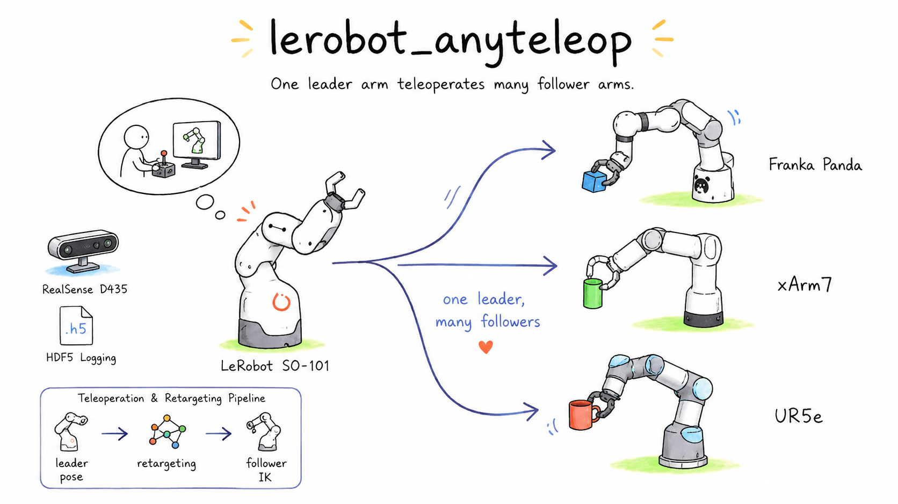
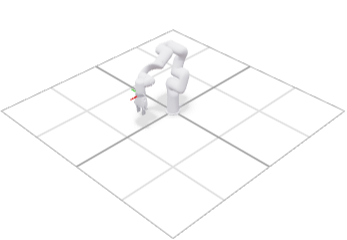
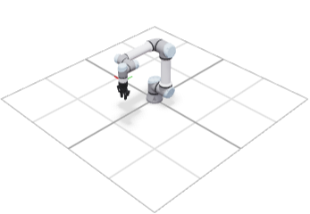
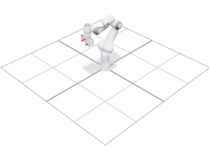
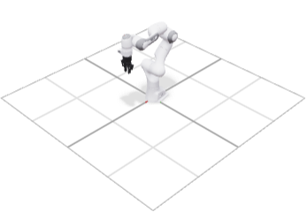

# lerobot_anyteleop

Kinematics-based teleoperation: drive a **follower robot** from a **LeRobot SO-101**
leader arm, recording multi-camera RealSense streams + robot state to **HDF5**
(convertible to LeRobot v2.1 / v3.0 datasets).



Followers are pluggable — **xArm7**, **Franka Panda / FR3**, and **UR5e** ship
in the box. An experimental **FANUC CRX-10iA/L** adapter is also included;
adding another arm is a registry entry + a small driver.

## How it works

The leader and follower have different kinematics, so motion is mapped in
**end-effector space**, not joint-by-joint:

```
SO-101 leader joints ──FK(pyroki)──▶ leader EE pose
                                          │
                              delta since clutch anchor
                                          │  × scale (position & orientation, 6-DOF)
                                          ▼
follower joints ◀──IK(pyroki)── follower EE target ◀── applied on the follower anchor
        │
        ├─▶ stream joint servo (xArm / UR / Panda, or FANUC ws_fanuc stream_executor)
        └─▶ record: joints + EE poses + RealSense frames ──▶ HDF5
```

* **FK/IK:** [pyroki](https://github.com/chungmin99/pyroki) (JAX). IK = analytic
  pose cost + joint-limit constraint + a small rest cost toward the current
  configuration (warm start) for smooth, jitter-free teleop. The kinematics is
  fully URDF-driven, so it's robot-agnostic.
* **Retargeting:** anchor/"clutch" based and drift-free. The follower moves
  relative to its pose at engage time; position and orientation scale
  independently. Re-engaging re-centers the workspaces (like indexing a mouse).
* **Joint mapping:** pyroki may expose more/reordered actuated joints than the
  hardware commands (e.g. a Panda finger joint). A name-based `JointMap` bridges
  the full FK/IK joint vector and the hardware arm joints, so any DOF works.

## Visualize it without hardware (viser)

The hardware-free path is an interactive 3D visualization that runs the **exact
same retargeting pipeline** as the real controller:

```bash
pixi run viz                                            # follower-only (xArm7)
pixi run -- anyteleop-viz --follower panda --no-leader  # or panda / ur5e
pixi run viz-with-leader                                # also render the SO-101 leader
# open the printed http://localhost:8080
```

Drag the leader joint sliders; the follower solves IK and moves in 3D, with live
position/orientation-scale sliders and a re-engage (clutch) button. By default
only the follower is shown (the SO-101 leader is just the input device); add
`viz-with-leader` / drop `--no-leader` to also render the leader.

### Live preview from the real SO-101 (no follower hardware)

Drive the viser preview from the **physical SO-101 leader** to see how the chosen
follower *would* move — without connecting any follower robot:

```bash
pixi install -e viz-live      # kinematics + viser + SO-101 driver (lerobot), no follower SDK
pixi run -e viz-live anyteleop-viz --follower xarm7 --leader-port /dev/ttyACM0
#   --leader-id <calib id>   --calibrate (first time)   --follower panda|ur5e
```

Move the leader and the follower tracks it in 3D. Use the **re-engage (clutch)**
button to re-anchor (the physical leader can't be reset like a slider). With
`--leader-port` omitted, the leader is driven by GUI sliders instead.

The **gripper is rendered and animated** by the gripper slider (or the leader's
gripper, in live mode). Each follower gets a sensible default (xArm7 → native xArm
gripper, UR5e → mounted Robotiq 2F-85, Panda → Franka Hand); override with
`--gripper-model`:

```bash
pixi run -- anyteleop-viz --follower ur5e  --gripper-model robotiq_2f85
pixi run -- anyteleop-viz --follower panda --gripper-model robotiq_2f85   # Panda + Robotiq
pixi run -- anyteleop-viz --follower xarm7 --gripper-model none
# any URDF / robot_descriptions name + a flange mount offset (m + rad):
pixi run -- anyteleop-viz --follower xarm7 --gripper-model /path/to/gripper.urdf \
    --gripper-mount 0 0 0.01 0 0 0
```

Example followers + grippers rendered live in viser:

| xArm7 (native gripper) | UR5e + Robotiq 2F-85 | Panda + Franka Hand | Panda + Robotiq 2F-85 |
| :---: | :---: | :---: | :---: |
|  |  |  |  |

![pipeline]: leader sliders → leader FK → retarget → follower IK → render

## Project layout

```
src/lerobot_anyteleop/
  transforms.py            # NumPy SE(3)/SO(3) math + Pose (no JAX)
  robots/registry.py       # RobotSpec registry: so101, xarm7, panda, ur5e, crx10ia_l
  joint_utils.py           # JointMap (arm <-> full), name-based reorder
  kinematics/              # pyroki FK/IK behind a KinematicsModel ABC
  retargeting/             # PoseRetargeter (6-DOF delta scaling)
  teleop/
    pipeline.py            # KinematicRetargetPipeline (FK->retarget->IK) — hardware-free core
    controller.py          # real-hardware control loop
  devices/
    leader/   {base, so101}                  # SO-101 via lerobot (lazy import)
    follower/ {base, xarm7, ur, franka, fanuc} # follower drivers, selected by backend
    gripper/  {base, none, xarm, robotiq, franka}  # pluggable grippers (normalized [0,1])
    camera/   {base, realsense, manager}     # RealSense D435 (lazy import)
  recording/hdf5_recorder.py # incremental, resizable, compressed HDF5
  config.py / factory.py     # YAML config -> kinematics/devices/system
  viz/ {viser_app, gripper_visual}  # interactive visualization + gripper mounting
  cli/                       # anyteleop, -viz, -list-cameras, -fetch-urdf, -inspect, -convert
configs/ {xarm7,panda,ur5e,crx10ia_l}.yaml
assets/urdf/so101/           # vendored SO-101 URDF (meshes via anyteleop-fetch-urdf)
assets/urdf/grippers/        # vendored gripper URDFs + meshes (Robotiq 2F-85)
tests/
```

## Setup (pixi)

```bash
pixi install                 # kinematics + viser + tests; solves on linux-64 / osx-arm64
pixi run test
pixi run fetch-urdf          # download SO-101 meshes (needed for viser)
pixi run viz                 # visualize SO-101 -> xArm7

# real hardware — one environment per follower (each adds the SO-101 leader + RealSense):
pixi install -e xarm         #  xArm7  (xArm-Python-SDK)
pixi install -e ur           #  UR5e   (ur_rtde)
pixi install -e franka       #  Panda  (panda-python; needs RT kernel + FCI)
pixi install -e fanuc        #  CRX-10iA/L + direct USB/RS-485 Robotiq

pixi run -e xarm anyteleop-list-cameras               # discover RealSense serials
# edit configs/xarm7.yaml (leader port, robot ip, serials), then:
pixi run -e xarm anyteleop --config configs/xarm7.yaml --record --task "pick up the red cube"
# collect several episodes, prompting for a language instruction before each:
pixi run -e xarm anyteleop --config configs/xarm7.yaml --record --episodes 20
```

## FANUC CRX-10iA/L + Robotiq 2F-140

**Status:** this is an experimental integration implemented against the local
`ws_fanuc` `master` at `309a81aa2468`. Its kinematics and message contract have
ROS-independent test coverage, but no command was sent to a real CRX or 2F-140
while developing it. Validate ROS message/QoS compatibility, joint signs/zeros,
and motion direction on your exact cell before enabling Cartesian operation.

The FANUC backend targets Ubuntu 24.04 / ROS 2 Jazzy and reuses the existing
`ws_fanuc` physical stack. It does not attempt to publish 500 Hz commands from
the Python camera/recording loop:

```text
SO-101 -> anyteleop IK (30 Hz) -> /stream_executor/joint_trajectory
       -> fanuc_stream_executor C++ (500 Hz + position/velocity/acceleration clamps)
       -> forward_position_controller -> FANUC Stream Motion
                         ^
                  safety_supervisor
```

The included model is specifically **CRX-10iA/L**. Do not substitute
`robot_model:=crx10ia`: the /L has a different second-link length and different
J1/J3 limits.

Before enabling motion, verify `echo $ROS_DISTRO` prints `jazzy`. This path
requires FANUC ROS 2 Driver v2.0.0 or later. On an R-30iB Mini Plus, FANUC
documents V9.40P/77 as the base driver minimum, while the forward-position
controller used here requires V9.40P/84 or later.
The controller also needs J519 Stream Motion + R912 Remote Motion, or the S636
External Control Package. See FANUC's [system requirements](https://fanuc-corporation.github.io/fanuc_driver_doc/main/docs/environment/system_requirements.html)
and [feature/version table](https://fanuc-corporation.github.io/fanuc_driver_doc/main/docs/fanuc_driver/fanuc_driver_overview.html).

Build and source `ws_fanuc`, then start its physical stack in a separate terminal:

```bash
source /opt/ros/jazzy/setup.bash
cd /path/to/ws_fanuc
rosdep install -iyr --from-paths src easy_handeye2 ros2_aruco
colcon build --cmake-args -DBUILD_TESTING=1 -DBUILD_EXAMPLES=1
source install/setup.bash

ros2 launch fanuc_stream_control stream_physical.launch.py \
  robot_model:=crx10ia_l robot_ip:=192.168.1.100 \
  setpoint_source:=waypoints join_enabled:=false require_supervisor:=true
```

The PC Ethernet NIC directly connected to the controller must have a unique
address in the same subnet (for example, robot `192.168.1.100`, PC
`192.168.1.10/24`). Confirm the actual address and `ping 192.168.1.100` before
launching; the `robot_ip` launch argument is the connection authority.

Keep `require_supervisor:=true`, retain the explicit `waypoints`/`join_enabled`
arguments shown above, and do not relax the other physical-launch safety
defaults. Confirm that the executor advances, then resume only after inspecting
the cell:

```bash
ros2 topic echo /stream_executor/status --once  # inspect period_p99_us / period_max_us
ros2 topic echo /stream_executor/status --field tick_seq  # observe multiple increasing values
ros2 topic echo /safety_supervisor/state --once
ros2 param get /stream_executor robot_model       # must be: crx10ia_l
ros2 param get /stream_executor publish_rate_hz   # must be: 500.0
ros2 param get /stream_executor join_enabled      # must be: false
ros2 param get /stream_executor setpoint_source   # must be: waypoints
ros2 param get /stream_executor require_supervisor # must be: true
ros2 service call /safety_supervisor/resume std_srvs/srv/Trigger '{}'
```

In a second sourced terminal, edit the leader/gripper ports in
[`configs/crx10ia_l.yaml`](configs/crx10ia_l.yaml). Its `follower.ip` is only
deployment metadata; keep it equal to the launch argument, which owns the real
connection. The Pixi environment supplies application dependencies, while
`rclpy` and `fanuc_stream_msgs` come from the sourced system ROS/workspace:

```bash
source /opt/ros/jazzy/setup.bash
source /path/to/ws_fanuc/install/setup.bash
pixi install -e fanuc
pixi run -e fanuc python -c \
  'import rclpy; from fanuc_stream_msgs.msg import StreamStatus, SupervisorState'
pixi run -e fanuc anyteleop --config configs/crx10ia_l.yaml
```

The sample uses PC -> USB/RS-485 adapter -> gripper Modbus RTU
(`pyRobotiqGripper`, slave ID 9), not raw USB and not FANUC I/O. Follow the
Robotiq manual for its 24 V supply and wiring, allow only one Modbus master,
grant the user serial access (commonly the `dialout` group), and prefer a stable
`/dev/serial/by-id/...` path over `/dev/ttyUSB0`. If the 2F-140 is wired to the
FANUC controller instead, this serial backend does not apply: configure
`gripper.type: none` and operate `ws_fanuc`'s `/gripper/close` + F[91]/F[92]
bridge separately, or first implement a ROS gripper backend to couple it to the
SO-101 command.
`activate_on_connect: true` performs the gripper's activation sweep, so clear
the fingers and workspace before starting; set it to `false` only when the
gripper has already been activated for the current power cycle.

The adapter repeats these executor-parameter checks itself before the first
motion. It rejects missing/reordered-invalid/non-finite state, stale
joint/executor/supervisor data, non-RUN safety state, joint-limit violations,
discontinuous IK steps, and targets that run too far ahead of the executor's
actual command. It also applies anyteleop admission thresholds to the 500 Hz
executor (period p99 <= 2.4 ms, max <= 6 ms). If these fail, fix kernel/CPU load
or real-time scheduling rather than merely relaxing the thresholds. Homing is
sent as a speed-scale-aware rolling sequence of small
targets, not as one long unattended trajectory, and an asynchronous stop
cancels all later home waypoints. A dedicated local watchdog freezes the fresh
executor setpoint if Python setpoints stall. This leaves the supervisor and
STREAM_MOTN armed; it is a best-effort setpoint stop, not a supervisor HOLD or
emergency stop. A SIGKILL/power failure can also kill that watchdog; the final
outstanding target remains lead-bounded but is not guaranteed to be zero-motion.
Guarded operation, the hardware E-stop, and an independent operator dead-man
therefore remain required.

`ws_fanuc` interprets each one-point teleoperation message as a hold, so its
plan-time scaling does not slow that message. The adapter therefore applies the
fresh executor `speed_scale` to its own elapsed-time-normalized joint-step
ceiling before publishing. This is a conservative speed ceiling rather than a
queued time-stretched path; it avoids leaving a long trajectory behind if the
Python process disappears. The HDF5 joint/EE action records the scaled target
actually sent, not the unscaled IK request.

`home_timeout_s` is an absolute wall-clock limit, not speed-scaled. At a very
low collaborative `speed_scale`, homing can intentionally fail after 120 s;
at scale zero it only refreshes the current hold until that timeout.

`anyteleop` automatically moves to the configured home
`[0, 0, 0, 0, -pi/2, 0]` before every episode. The bundled URDF uses
joint-frame dimensions/axes copied from the pinned `ws_fanuc` model, but its
geometry is only schematic and the real joint signs/zeros remain unverified:
there is no collision/self-collision checking. Clear and inspect the entire
swept volume first. Keep the FANUC
TP/general override at the value required by Stream Motion (normally 100%);
commission slowly with `home_speed_rad_s`, `position_scale`,
`orientation_scale`, `velocity_safety_factor`, and the controller's approved
collaborative-safety settings instead of lowering general override.

Preview the local /L kinematics before connecting hardware:

```bash
pixi run -- anyteleop-viz --follower crx10ia_l --no-leader
```

Start arm-only commissioning with `gripper.type: none`. Before even the first
automatic home with the gripper mounted, configure and validate the complete
gripper/adapter/workpiece payload, center of gravity, and inertia in the FANUC
controller.

IK currently targets the bare `fanuc_flange`; the 2F-140 adapter and TCP offset
are not part of the URDF. Setting FANUC UTOOL alone does **not** correct the
external anyteleop IK. Tool-tip Cartesian teleoperation remains unsupported
until the measured flange-to-TCP fixed transform is added to this URDF, the
robot spec/config selects that TCP link as `follower.ee_link`, and the matching
UTOOL is verified. After a run, use the cell's approved procedure to disarm
remote motion; exiting this Python process alone does not disarm STREAM_MOTN.

Each recorded episode carries a **language instruction** (LeRobot's per-episode
`task`). Provide it with `--task` (reused for every episode), or omit it and the
tool prompts before each episode; `--episodes N` records N episodes in one
session (re-homing between). Ctrl-C ends the current episode.

> The `default` environment has the full **kinematics stack** (jax + pyroki +
> viser) so visualization and the whole retarget→IK pipeline are testable with no
> hardware. Robot/camera SDKs live only in the per-robot environments and are
> imported lazily.
>
> **RealSense on Apple Silicon:** the official `pyrealsense2` has no arm64 wheel;
> the `osx-arm64` target uses the community `pyrealsense2-macosx` build.

## Adding a follower robot

1. Add a `RobotSpec` to `robots/registry.py` (URDF source — a `robot_descriptions`
   name or a path — EE link, `arm_joint_names`, `home`, default `follower_backend`).
2. Add a driver in `devices/follower/` implementing `FollowerInterface` and
   register it in `devices/follower/__init__.py`.

Custom follower drivers must also implement an idempotent `stop()` that is safe
before connection and after a previous stop; the controller invokes it on normal
completion, Ctrl-C, and control-loop exceptions.

Kinematics, retargeting, recording, and the viser app then work unchanged.

## Grippers (pluggable, independent of the arm)

The SO-101 leader's gripper joint is read as a normalized command in `[0, 1]`
(1 = open, 0 = closed) and mapped to whatever gripper is attached, configured
under `follower.gripper`:

| `type` | gripper | how it's driven | needs |
|---|---|---|---|
| `xarm` | xArm native gripper | shares the arm's `XArmAPI` (`set_gripper_position`) | `xarm` env |
| `robotiq` | Robotiq 2F-85 / 2F-140 | UR socket (`backend: ur`) or USB Modbus (`backend: serial`) | `robotiq` (in every hw env) |
| `franka` | Franka Hand | `panda_py` gripper on a background thread (`move`/`grasp`) | `franka` env |
| `none` | — | no-op (default) | — |

```yaml
follower:
  robot: xarm7
  ip: 192.168.1.185
  gripper: { type: xarm, options: { speed: 2000 } }
  # robotiq on a UR:   gripper: { type: robotiq, options: { backend: ur } }   # host = follower.ip:63352
  # robotiq via USB:   gripper: { type: robotiq, options: { backend: serial, com_port: /dev/ttyUSB0 } }
  # franka hand:       gripper: { type: franka,  options: { speed: 0.1, force: 40 } }
```

Each driver maps `[0,1]` to its hardware units (xArm 0..850, Robotiq 0..255
inverted, Franka 0..max_width m) and declares a `deadband` so slow grippers
(Franka/Robotiq) aren't spammed at the control-loop rate. The Robotiq `ur`
backend needs UR's standalone `robotiq_gripper.py` vendored (it is not a pip
package); the `serial` backend uses `pyRobotiqGripper`.

**Visualization** of the gripper (in `anyteleop-viz`) is separate from the
command driver and selected with `--gripper-model`. The gripper is either part of
the arm URDF (xArm rendered with its gripper; Franka Hand in `panda_description`)
or a separate URDF mounted at the flange, animated by the gripper slider. The
Robotiq 2F-85 is **vendored** (editable) under
`assets/urdf/grippers/robotiq_2f85/`.

Two editable tables in `viz/gripper_visual.py` make mounting correct across arms:

* `GRIPPER_MOUNTS` — per-arm flange→gripper transform. UR's `tool0` needs none;
  xArm `link_eef` and the Panda flange are rotated 90° about yaw vs it, so mounted
  grippers get a yaw correction there (flip the sign if yours points the other
  way, or override per run with `--gripper-mount X Y Z R P Y`).
* `STRIP_ON_MOUNT` — arm links hidden when a separate gripper is mounted; e.g.
  Panda + Robotiq drops the built-in Franka Hand so the two don't double up.

## Recorded HDF5 schema

One `episode_XXXXXX.hdf5` per episode (datasets grow per step):

| dataset | shape | dtype | meaning |
|---|---|---|---|
| `/observation/follower_qpos` | `(T, N)` | f32 | measured follower joints (rad) |
| `/observation/follower_ee_pose` | `(T,7)` | f32 | `[x,y,z, qw,qx,qy,qz]` |
| `/observation/leader_qpos` | `(T,6)` | f32 | 5 arm joints + gripper |
| `/observation/leader_ee_pose` | `(T,7)` | f32 | leader EE pose |
| `/observation/images/<cam>` | `(T,H,W,3)` | u8 | RGB (gzip, per-frame chunks) |
| `/observation/depth/<cam>` | `(T,H,W)` | u16 | optional |
| `/action/follower_qpos` | `(T, N)` | f32 | joint target actually sent (the action) |
| `/action/follower_ee_pose` | `(T,7)` | f32 | FK pose of the joint target actually sent |
| `/action/gripper` | `(T,1)` | f32 | normalized gripper |
| `/timestamp` | `(T,)` | f64 | seconds since episode start |

`N` = follower arm DOF (7 xArm7/Panda, 6 UR5e). Attributes store `fps`, `task`
(the language instruction), `instruction`, joint/camera names, `num_steps`.

```bash
anyteleop-inspect data/recordings/episode_000000.hdf5
```

## Convert to a LeRobot dataset

```bash
anyteleop-convert --input-dir data/recordings --dry-run     # inspect the mapping (no lerobot needed)
pixi run -e xarm anyteleop-convert --input-dir data/recordings --repo-id local/anyteleop
```

Mapping: `observation.state ← follower_qpos`, `action ← action/follower_qpos`,
`observation.images.<cam> ← images/<cam>`, and the per-episode `task` attribute
becomes each frame's language instruction. The LeRobot dataset API changed across
v2.x/v3.0, so the write path is a version-flagged best-effort scaffold; the
`--dry-run` mapping is stable. See `cli/convert_to_lerobot.py`.

## Hardware notes / things to verify on a real rig

* **Leader units:** SO-101 `get_action()` returns degrees (calibration-centered)
  for the 5 arm joints + `0..100` for the gripper. If the leader calibration zero
  differs from the URDF zero, set `leader.joint_sign` / `joint_offset`.
* **Servo modes:** xArm streams `set_servo_angle_j` in mode 1; UR uses `servoJ`
  (set `follower.options.servo_dt` ≈ `1/rate_hz`); Panda uses a 1 kHz
  `JointPosition` controller (raise `loop.rate_hz`). Keep per-step deltas small.
* **Frame alignment:** if leader and follower are mounted differently, set
  `retarget.align_rpy` so leader deltas map sensibly onto the follower.
* **Workspace:** IK clamps to joint limits; tune `retarget.position_scale` so the
  leader workspace maps inside the follower's reach.
